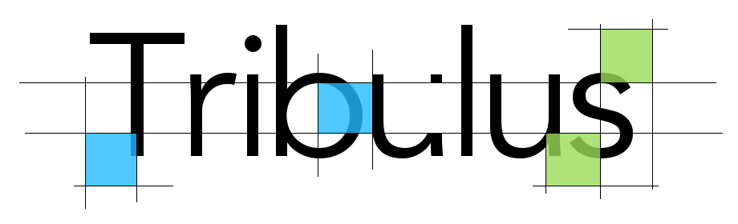

<p align="center">
  
</p>

[](https://travis-ci.org/rosberry/Tribulus)
[](http://cocoadocs.org/docsets/Tribulus)
[](https://github.com/Carthage/Carthage)
[](http://cocoadocs.org/docsets/Tribulus)

[](http://cocoadocs.org/docsets/Tribulus)

**Tribulus** provides very convenient way to compose attributed strings.
It is a framework based on usage custom `Attributes` class and nice chaining syntax.

# Installation 🏁

### Carthage

[Carthage](https://github.com/Carthage/Carthage) is a decentralized dependency manager that builds your dependencies and provides you with binary frameworks.

You can install Carthage with [Homebrew](http://brew.sh/) using the following command:

```bash
$ brew update
$ brew install carthage
```
To integrate Tribulus into your Xcode project using Carthage, specify it in your `Cartfile`:

```ogdl
github "rosberry/Tribulus"
```

Run `carthage update` to build the framework and drag the built `Tribulus.framework` into your Xcode project.

### CocoaPods

[CocoaPods](http://cocoapods.org) is a dependency manager for Swift and Objective-C Cocoa projects. It has over eighteen thousand libraries and can help you scale your projects elegantly. You can install it with the following command:

```bash
$ sudo gem install cocoapods
```

To integrate Tribulus via CocoaPods, just add the following line to your `Podfile`:

```ruby
pod "Tribulus"
```

Then, run the following command:

```bash
$ pod install
```

### Manually

Drag `Sources` folder from [latest release](https://github.com/rosberry/Tribulus/releases) into your project.

# Usage 🏄‍

### Initialization

To initialize attributed string with required attributes, you can use following code:

```swift
let attributedString = NSAttributedString(string: testString) {
		$0.font = .systemFont(ofSize: 10, weight: UIFontWeightBold)
        	$0.backgroundColor = .green
        	$0.color = .black
        	$0.baselineOffset = 14.0
    	    }
```

### Appending

**Tribulus** also allows appending to existing mutable attributed string.

Here's a code for appending new attributed string:

```swift
let attributedString = NSMutableAttributedString(string: "Foo")
attributedString
    	.append(string: " Bar") {
        	$0.color = .red
        }
        .append(string: " Baz") {
            $0.direction = .horizontal
        }
```

And in the same simple way you can append any image:

```swift
let attributedString = NSMutableAttributedString(string: "Foo")
attributedString.append(image: UIImage(named: "Bar"), 
    					bounds: CGRect(x: 0, y: 0, width: 40, height: 40))
```
### Insertion

Moreover **Tribulus** allows you to insert newly configured attributed string at any location:

```swift
let attributedString = NSMutableAttributedString(string: "Foo  Baz")
 attributedString
	.insert(string: "Bar", at: 4) {
            $0.textEffect = .letterpress
        }
```

or to insert an image:

```swift
attributedString.insert(image: UIImage(named: "Bar"), 
			bounds: CGRect(x: 0, y: 0, width: 40, height: 40), 
                        at: 0)
```

### Additions

Instead on creating `UIFontDescriptorSymbolicTraits` you can just set **bold** and **italic** traits using `Attributes` object properties:

```swift
let attributedString = NSAttributedString(string: testString) {
		$0.bold = true
    		$0.italic = true
	    }
```

# Author 🖌

Dmitry Frishbuter, dmitry.frishbuter@rosberry.com

# License 📃

Tribulus is available under the MIT license. See the LICENSE file for more info.
